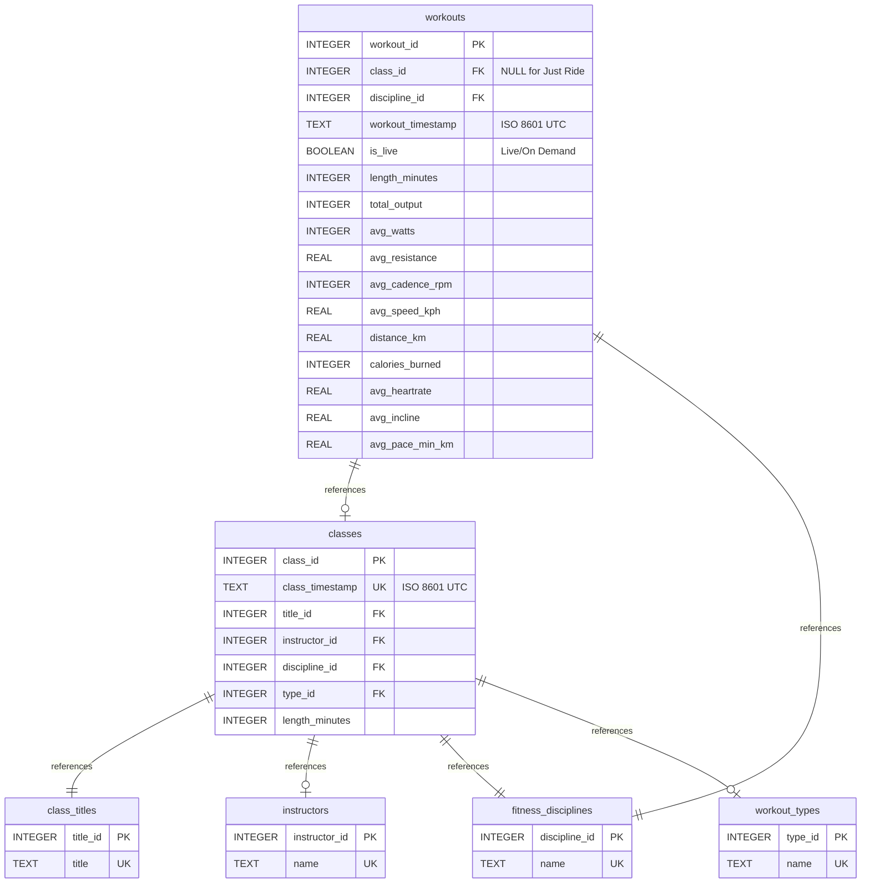

**Disclaimer:**

This project is provided **as is**, with no warranty or guarantee of any kind. Use at your own risk.

- **No affiliation:** This tool is not affiliated with, endorsed by, or connected to Peloton Interactive, Inc. or any of its services.
- **No interaction with Peloton:** The tool does **not** connect to, interact with, or download data from any Peloton servers or services.
- **User-supplied data only:** All data must be imported from a workout CSV file that **you** download yourself from your own Peloton account. This tool does not facilitate or automate any data download from Peloton.
- **No monetization:** This project is open source and provided free of charge. I do not make any money from it.

---

# Peloton Workout Database Importer

This tool imports Peloton workout CSV data into a normalized SQLite database for easy analysis and querying.

## Features

- **Normalized database schema** - No repeated data for instructors, disciplines, types, or titles
- **Proper datetime handling** - Converts all timezone formats (EST, -04, CET, etc.) to ISO 8601 with Z (UTC)
- **Just Ride support** - Properly handles workouts done without a class
- **Live vs On Demand tracking** - Records how you took each class
- **Class repetition tracking** - Take the same class multiple times

## Database Structure



## Usage

```bash
python import_peloton.py <input_csv_file>
```

The script will create a SQLite database with the same name as the input file but with `.sqlite` extension.

Example:
```bash
python import_peloton.py hflickster_workouts.csv
# Creates: hflickster_workouts.sqlite
```

## Database Schema

### Lookup Tables

- **instructors** - Unique list of instructors
- **fitness_disciplines** - Cycling, Meditation, Strength, etc.
- **workout_types** - Music, Beginner, Low Impact, etc.
- **class_titles** - "20 min Beginner Ride", etc.

### Main Tables

#### classes
Represents Peloton's class catalog. Each unique class is identified by its `class_timestamp`.

- `class_id` (PRIMARY KEY)
- `class_timestamp` (UNIQUE) - When the class was recorded/broadcast (ISO 8601 UTC)
- `title_id` → class_titles
- `instructor_id` → instructors
- `discipline_id` → fitness_disciplines
- `type_id` → workout_types
- `length_minutes`

#### workouts
Your actual workout sessions. You can take the same class multiple times.

- `workout_id` (PRIMARY KEY)
- `class_id` → classes (NULL for Just Ride)
- `discipline_id` → fitness_disciplines
- `workout_timestamp` (ISO 8601 UTC) - When YOU took the workout
- `is_live` - TRUE for Live, FALSE for On Demand, NULL for Just Ride
- `length_minutes`
- Performance metrics: `total_output`, `avg_watts`, `avg_resistance`, `avg_cadence_rpm`, `avg_speed_kph`, `distance_km`, `calories_burned`, `avg_heartrate`, `avg_incline`, `avg_pace_min_km`

### Key Design Decisions

1. **class_timestamp uniquely identifies a class** - This is when Peloton recorded/broadcast it
2. **workout_timestamp** - When you actually took the workout
3. **Just Ride workouts** have `class_id = NULL` and `is_live = NULL`
4. **Percentages stored as decimals** - "38%" becomes 0.38
5. **All timestamps in UTC** - Using ISO 8601 format with Z suffix for easy JavaScript usage

## Example Queries

See [example_queries.sql](example_queries.sql) for a comprehensive set of example queries including:

- Monthly/weekly/daily workout statistics
- Most frequent instructors
- Classes taken multiple times
- Performance metrics and trends
- Just Ride analysis
- Live vs On Demand comparison

### Quick Examples

**Monthly workout summary:**
```sql
SELECT 
    strftime('%Y-%m', workout_timestamp) as month,
    COUNT(*) as workouts,
    SUM(calories_burned) as total_calories
FROM workouts 
GROUP BY month
ORDER BY month DESC;
```

**Top instructors:**
```sql
SELECT 
    i.name,
    COUNT(*) as workout_count
FROM workouts w
JOIN classes c ON w.class_id = c.class_id
JOIN instructors i ON c.instructor_id = i.instructor_id
GROUP BY i.name
ORDER BY workout_count DESC;
```

**Classes taken multiple times:**
```sql
SELECT 
    ct.title,
    i.name as instructor,
    COUNT(*) as times_taken
FROM workouts w
JOIN classes c ON w.class_id = c.class_id
JOIN class_titles ct ON c.title_id = ct.title_id
JOIN instructors i ON c.instructor_id = i.instructor_id
GROUP BY c.class_id
HAVING times_taken > 1
ORDER BY times_taken DESC;
```

## Using in JavaScript

Since all timestamps are in ISO 8601 format with Z, you can easily use them in JavaScript:

```javascript
const sqlite3 = require('sqlite3');
const db = new sqlite3.Database('hflickster_workouts.sqlite');

db.all('SELECT workout_timestamp, calories_burned FROM workouts', (err, rows) => {
  rows.forEach(row => {
    const date = new Date(row.workout_timestamp); // Just works!
    console.log(date.toLocaleDateString(), row.calories_burned);
  });
});
```

## Command-Line Queries

Use the `sqlite3` command-line tool for quick queries:

```bash
# Basic query
sqlite3 hflickster_workouts.sqlite "SELECT COUNT(*) FROM workouts"

# Formatted output
sqlite3 -column -header hflickster_workouts.sqlite "SELECT * FROM instructors"

# CSV output
sqlite3 -csv hflickster_workouts.sqlite "SELECT * FROM workouts" > workouts_export.csv
```

## Requirements

- Python 3.6+
- No external dependencies (uses only Python standard library)

## License

MIT
